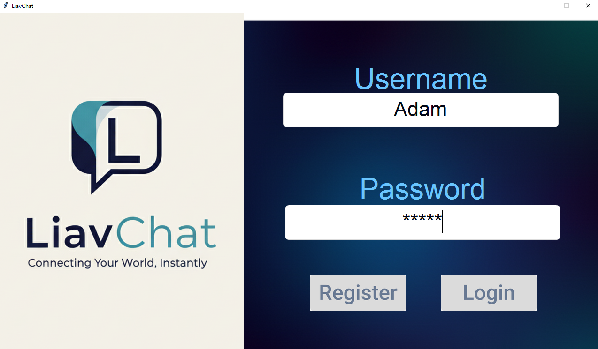
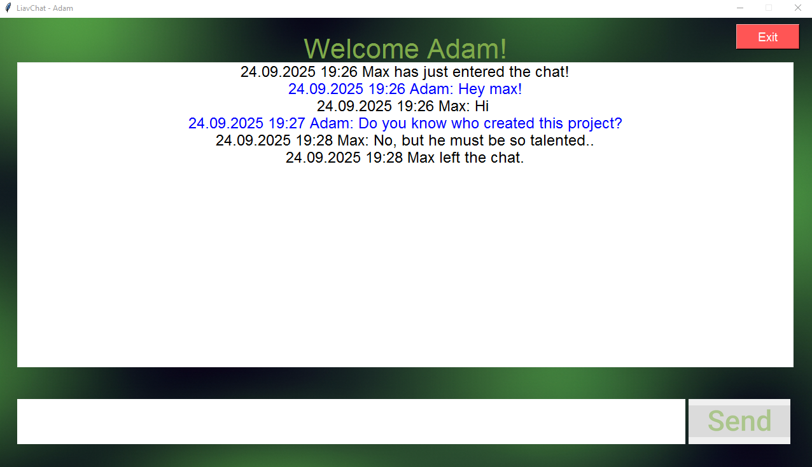

# ChatRoomAPP

 - **My goal**: making a secure mutli client server, built in python.

## Main features
- User authentication 
- Multi-threading for handling multiple clients
- SQLite database used for saving messages,users
- Encrypted SQLite passwords
- SSL encrypted connections
- Working Graphical Interface with login and chat page 




## Installation guide
- **Clone the repository** - 
```
 git clone https://github.com/L33TAv/chatroomAPP.git
```
- **Install requirements** - 
```
cd chatroomAPP
pip install -r requirements.txt
```
- **Generate Certificate and Private Key** -

enter private password, and certificate information 
```
password = b""  # --- enter your password here. ---

subject = issuer = x509.Name([ # --- enter your certificate information here. ---
    x509.NameAttribute(NameOID.COUNTRY_NAME, u""),
    x509.NameAttribute(NameOID.STATE_OR_PROVINCE_NAME, u""),
    x509.NameAttribute(NameOID.LOCALITY_NAME, u""),
    x509.NameAttribute(NameOID.ORGANIZATION_NAME, u""),
    x509.NameAttribute(NameOID.COMMON_NAME, u""),
```
run generate_cert.py

run server.py to host the server, login_gui.py to start connection as a client.

## Acknowledgements
 [Tkinter-Designer used with Figma](https://github.com/ParthJadhav/Tkinter-Designer)